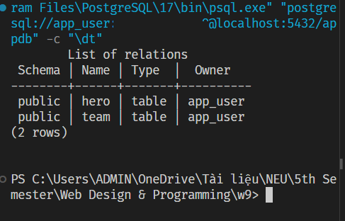
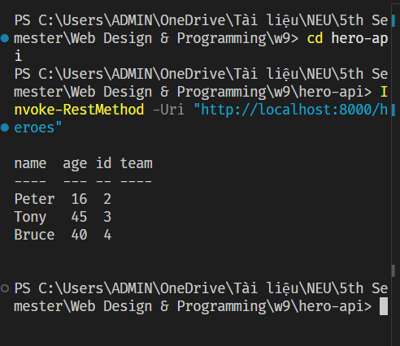
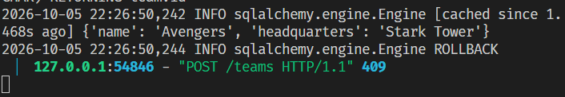
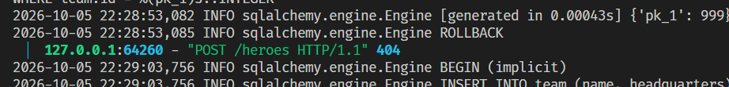
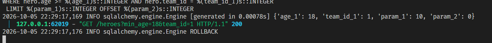
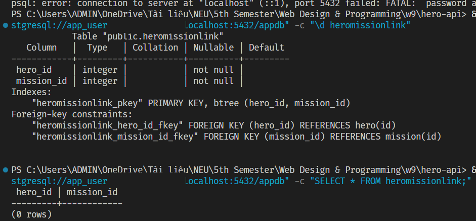
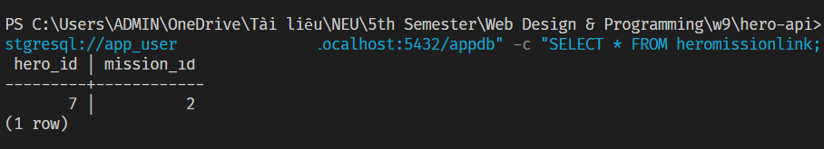
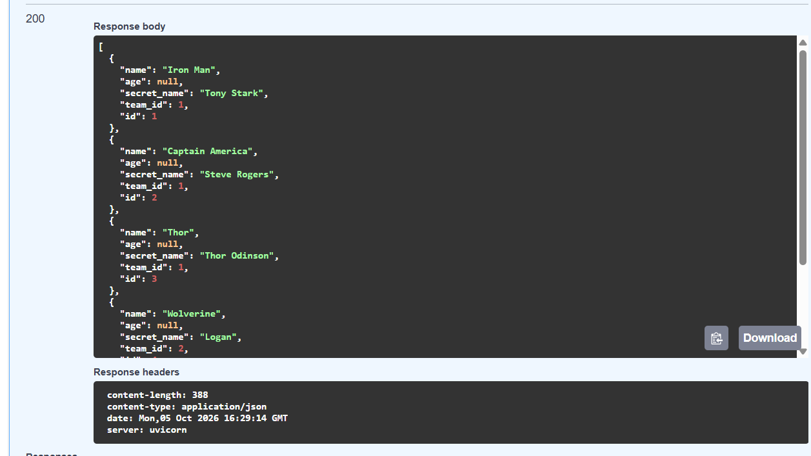
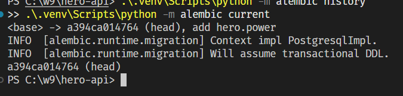

# Week 9 – Lab 2: Relational Databases with PostgreSQL, SQLModel & Alembic

**Course:** Web Design & Programming
**Topics:** SQL fundamentals and constraints, ORM modeling with SQLModel, REST API with FastAPI, many-to-many relationships, and schema migrations with Alembic

---

## Table of Contents

1. [Part 1 – SQL, Constraints and Relationships (Questions 1–3)](#part-1--sql-constraints-and-relationships)
2. [Part 2 – Connecting Python to PostgreSQL (Question 4)](#part-2--connecting-python-to-postgresql)
3. [Part 3 – Models with SQLModel (Questions 5–6)](#part-3--models-with-sqlmodel)
4. [Part 4 – Creating Tables (Questions 7–9)](#part-4--creating-tables)
5. [Part 5 – CRUD Endpoints (Questions 10–12)](#part-5--crud-endpoints)
6. [Part 6 – Filtering Queries (Questions 13–14)](#part-6--filtering-queries)
7. [Part 7 – Many-to-Many Models (Question 15)](#part-7--many-to-many-models)
8. [Part 8 – Seeding Data (Question 16)](#part-8--seeding-data)
9. [Part 9 – Schema Migrations with Alembic (Questions 17–20)](#part-9--schema-migrations-with-alembic)

---

## Part 1 – SQL, Constraints and Relationships

### 1.2 Insert and Query

#### Task 1

Write SQL queries for:

1. All heroes aged 18 or older, oldest first.
2. Each hero's name next to their team's name (heroes without a team must also appear).
3. The number of heroes per team.
4. The 2nd page of heroes when a page has 2 rows, ordered by `id`.

#### Solution

**1. All heroes aged 18 or older, oldest first**

```sql
SELECT *
FROM hero
WHERE age >= 18
ORDER BY age DESC;
```

**2. Each hero's name next to their team's name (heroes without a team must also appear)**

A `LEFT JOIN` keeps every hero, even when `team_id` is `NULL`.

```sql
SELECT h.name AS hero_name,
       t.name AS team_name
FROM hero h
LEFT JOIN team t
       ON h.team_id = t.id;
```

**3. The number of heroes per team**

```sql
SELECT t.name      AS team_name,
       COUNT(h.id) AS hero_count
FROM team t
LEFT JOIN hero h
       ON h.team_id = t.id
GROUP BY t.name
ORDER BY hero_count DESC;
```

**4. The 2nd page of heroes (page size = 2)**

```sql
SELECT *
FROM hero
ORDER BY id
LIMIT 2 OFFSET 2;
```

### 1.3 Constraints and Relationships

#### Question 1

*For each of the four statements, which constraint blocked it (`PRIMARY KEY`, `UNIQUE`, `NULL`, `FOREIGN KEY`) and why?*

**Statement 1 – Duplicate team name**

```sql
INSERT INTO team (name, headquarters) VALUES ('Avengers', 'Los Angeles');
```

```text
ERROR: duplicate key value violates unique constraint "team_name_key"
Key (name)=(Avengers) already exists.
SQL state: 23505
```

- **Constraint:** `UNIQUE`
- **Reason:** The `team` table already contains a row with `name = 'Avengers'`. Inserting another team with the same name is rejected because a `UNIQUE` constraint does not allow duplicate values in that column.

**Statement 2 – Non-existent team reference**

```sql
INSERT INTO hero (name, team_id) VALUES ('Ghost', 99);
```

```text
ERROR: insert or update on table "hero" violates foreign key constraint "hero_team_id_fkey"
Key (team_id)=(99) is not present in table "team".
SQL state: 23503
```

- **Constraint:** `FOREIGN KEY`
- **Reason:** The `team_id` column references `team(id)`. Since no team with `id = 99` exists, the insert fails.

**Statement 3 – Missing required value**

```sql
INSERT INTO hero (age) VALUES (30);
```

```text
ERROR: null value in column "name" of relation "hero" violates not-null constraint
Failing row contains (6, null, 30, null).
SQL state: 23502
```

- **Constraint:** `NOT NULL`
- **Reason:** The `name` column is declared `NOT NULL`. The statement supplies only `age`, leaving `name` as `NULL`, so PostgreSQL rejects the row.

**Statement 4 – Deleting a referenced parent row**

```sql
DELETE FROM team WHERE id = 1;
```

```text
ERROR: update or delete on table "team" violates foreign key constraint "hero_team_id_fkey" on table "hero"
Key (id)=(1) is still referenced from table "hero".
SQL state: 23503
```

- **Constraint:** `FOREIGN KEY`
- **Reason:** There are heroes whose `team_id = 1`. Because of the foreign key relationship, PostgreSQL prevents deleting a team that is still referenced by heroes.

#### Question 2

*The relationship `team → hero` is one-to-many. Why is the foreign key on `hero` and not on `team`?*

- **If `team_id` is on `hero` (the "many" side):** Each hero belongs to at most one team, so a single integer column `team_id` cleanly stores that reference for each hero row.
- **If `hero_id` were on `team` (the "one" side):** A team has many heroes (e.g., Avengers has Iron Man, Thor, Hulk). A single scalar `hero_id` column could only point to one hero. Assigning multiple heroes to a team would then require either violating First Normal Form (1NF), for example by storing a delimited list such as `"1,2,3"`, or duplicating the entire team row for every member.

#### Question 3

*Heroes can go on many missions and a mission has many heroes (many-to-many). Sketch the tables you need (names, columns, PK, FK).*

A many-to-many (M:N) relationship between `hero` and `mission` requires two entity tables and one junction (link) table, `hero_mission`.

```sql
CREATE TABLE mission (
    id         SERIAL PRIMARY KEY,
    name       VARCHAR NOT NULL,
    difficulty VARCHAR,
    location   VARCHAR
);

CREATE TABLE hero_mission (
    hero_id     INTEGER REFERENCES hero(id)    ON DELETE CASCADE,
    mission_id  INTEGER REFERENCES mission(id) ON DELETE CASCADE,
    assigned_at TIMESTAMP DEFAULT CURRENT_TIMESTAMP,
    PRIMARY KEY (hero_id, mission_id)
);
```

| Table          | Primary Key             | Foreign Keys                                     |
| -------------- | ----------------------- | ------------------------------------------------ |
| `hero`         | `id`                    | `team_id → team(id)`                             |
| `mission`      | `id`                    | –                                                |
| `hero_mission` | `(hero_id, mission_id)` | `hero_id → hero(id)`, `mission_id → mission(id)` |

---

## Part 2 – Connecting Python to PostgreSQL

### 2.3 Configuration

#### Question 4

*Why read the URL from an environment variable instead of writing it in `database.py`? Give two reasons.*

1. **Security:** If connection information (including the database username and password) is hardcoded in the source code, anyone with access to the repository can see and steal the credentials, for example when the code is pushed to a public repository such as GitHub. Environment variables keep this sensitive information outside the source code.
2. **Environment flexibility:** Real-world applications run in several environments (local development, staging, production). Environment variables make it possible to change the database connection address per environment without modifying a single line of code.

---

## Part 3 – Models with SQLModel

#### Question 5

*Why is `id` typed `int | None` with `default=None`, when every row in the database has an `id`?*

When a new hero is created and sent to the server, the record does not yet exist in the database, so it has no `id`; the database generates it automatically after the row is saved. The type must therefore be `int | None` with a default of `None`, so the application does not raise a validation error when it receives new data from the client. Once the row is stored, the database assigns a concrete `int` value.

#### Question 6

*Which attributes of `Hero` become columns, and which one does not? What is `back_populates` for?*

- **Columns:** Attributes with basic data types (such as `name`, `age`, `secret_name`, `team_id`) become columns in the database table.
- **Not columns:** Attributes defined with `Relationship` (such as `team` on `Hero` or `heroes` on `Team`) do **not** become columns. They are virtual attributes that let developers navigate between the two tables in Python (for example, from a hero to its team, or from a team to its members).
- **`back_populates`:** Creates a two-way (bidirectional) relationship between `Team` and `Hero`. It tells SQLAlchemy that `team.heroes` and `hero.team` describe the same relationship, so both sides stay in sync.

---

## Part 4 – Creating Tables

#### Question 7

*Compare the `CREATE TABLE hero` printed by SQLAlchemy with the one you wrote by hand in Part 1. List the differences (types, `NOT NULL`, indexes, constraints).*

The statement generated by SQLAlchemy is typically stricter and more detailed:

- **Types:** Python types are mapped precisely (e.g., `VARCHAR` for strings, `INTEGER` for numbers).
- **`NOT NULL`:** Required fields (`name`, `secret_name`) are automatically declared `NOT NULL`, while optional fields (`age`, `team_id`) allow `NULL`.
- **Constraints:** The `PRIMARY KEY` and the `FOREIGN KEY` (linking `team_id` to the `team` table) are generated automatically.
- **Indexes:** Indexes are created for fields marked with `index=True`.

#### Question 8

*Stop and restart the server. Is `CREATE TABLE` printed again? Why? What does `create_all` do when a table already exists?*

No, `CREATE TABLE` is **not** printed again. `create_all()` first checks whether each table already exists in the database. If a table exists, it is skipped and left untouched, which prevents existing data from being lost.

#### Question 9

*`create_all` only knows about models that have been imported. Which line in `app/main.py` makes sure `Hero` and `Team` are registered?*

```python
from app.models import Hero, Team
```

Without this import, SQLAlchemy cannot "see" the `Hero` and `Team` models, so their tables would not be created in the database.

**Screenshot – `\dt` output showing the `hero` and `team` tables**



---

## Part 5 – CRUD Endpoints

#### Question 10

*Comment out `session.commit()` in `create_hero` and create a hero. What does the response look like, and is the row in the database (`SELECT * FROM hero;`)? Put the line back. What does `add()` do on its own, and why do we need `refresh()`?*

- **Response:** Without `commit()`, FastAPI/SQLModel can still return the hero as JSON, because the data exists on the Python object in memory (for example, `id` may be `None` or only temporarily assigned).
- **Is the row in the database?** No. Running `SELECT * FROM hero;` directly in PostgreSQL shows no new row, because the transaction was never committed and therefore never permanently saved.
- **`session.add(obj)`:** Only places the object under the session's tracking (queues the change). Nothing is written to the database yet.
- **`session.refresh(obj)`:** Reloads the object's state from the database back into Python. This is important because it picks up values generated by the database (such as the auto-incremented `SERIAL` primary key `id`, or column defaults), so the correct data is returned to the client.

#### Question 11

*Look at the `PATCH` with body `{"age": 17}`. Does it update every column or only `age`? Why? Which SQL statement does `echo=True` print for it?*

- **Which columns are updated?** Only `age`. Other columns such as `name` and `secret_name` are not touched.
- **Why?** The update code uses `hero_in.model_dump(exclude_unset=True)`, which removes every field the client did not send in the request body. Then `hero.sqlmodel_update(hero_data)` applies only the fields that were actually provided.
- **SQL printed by `echo=True`:**

```sql
UPDATE hero SET age = 17 WHERE hero.id = 1;
```

The statement updates only the `age` column rather than all columns.

#### Question 12

*Look at the JSON returned by `GET /heroes/{id}`. Is `secret_name` there? Which line of code is responsible?*

- **Is `secret_name` present?** No. The field is hidden and does not appear in the JSON returned to the client.
- **Responsible line:** The response model declared on the endpoint decorator:

```python
@app.get("/heroes/{hero_id}", response_model=HeroPublic)
```

The `response_model=HeroPublic` parameter acts as the data filter. `HeroPublic` is designed to contain only public fields (such as `id`, `name`, `age`) and excludes sensitive information such as `secret_name` before the response is sent out.

**Screenshot – `GET /heroes` response (PowerShell `Invoke-RestMethod`)**



---

## Part 6 – Filtering Queries

#### Question 13

*Call `GET /heroes?min_age=18&team_id=1` and copy the `SELECT` printed by `echo=True`. Where do the values `18` and `1` appear? Why is this safe against SQL injection?*

The values `18` and `1` appear as **bound parameters (placeholders)** rather than being concatenated directly into the query string (for example, `WHERE age >= ? AND team_id = ?`). This is completely safe against SQL injection because the database treats the parameters purely as data values. They are never compiled or executed as SQL code or system commands.

#### Question 14

*Why filter in the database instead of `[h for h in session.exec(select(Hero)).all() if h.age >= 18]`?*

Filtering in the database improves **performance and saves memory**. With a Python list comprehension, the application must load thousands or millions of rows from the database into RAM before filtering, wasting network bandwidth, memory, and CPU. A database engine, on the other hand, is purpose-built to filter data quickly (using indexes) and returns only the rows that are actually needed.

**Screenshots – `echo=True` log output**







---

## Part 7 – Many-to-Many Models

#### Question 15

*On restart, `create_all` did create `mission` and nothing for `hero`. What is the rule?*

**Rule:** `SQLModel.metadata.create_all(engine)` is idempotent and only creates tables that do **not** already exist in the database.

Because the `hero` table was already created in a previous step (Part 4), `create_all` skipped it and left it untouched. The `mission` and `heromissionlink` tables were newly added models that did not yet exist, so `create_all` detected their absence and created them during the restart.

**Screenshots – Structure and contents of the `heromissionlink` table**





---

## Part 8 – Seeding Data

#### Question 16

*You never set `team_id` in the seed script. Read the `echo=True` output: in which order were the `INSERT`s executed, and how did `hero.team_id` get its value?*

**Execution order of the INSERTs**

1. **First:** the parent record (`Team`) is inserted into the database.
2. **Second:** the child record (`Hero`) is inserted into the database.

**How `hero.team_id` got its value**

1. When the `Team` instance was assigned directly to the `Hero` object (using relationship attributes), SQLAlchemy registered this object dependency inside the active session.
2. When `session.commit()` runs, SQLAlchemy detects that the `Hero` depends on the `Team`. It saves the `Team` first so the database can generate its primary key (`id`).
3. SQLAlchemy then takes the newly generated primary key and automatically injects it into the child's foreign key field (`hero.team_id`) just before executing the `INSERT` statement for the `Hero`.

**Screenshot – `GET /heroes` response in Swagger UI (HTTP 200)**



---

## Part 9 – Schema Migrations with Alembic

#### Question 17

No, the `power` column does not appear in the database. `create_all()` only creates tables if they don't exist; it does **not** modify existing table schemas when models change. Calling `GET /heroes` may therefore cause a validation error or omit the field, depending on the Pydantic models in use.

Dropping and re-creating tables is unacceptable in production because it permanently destroys all existing user data.

> *Note: the question text for Question 17 is not included in the original document.*

#### Question 18

*What are the contents of `upgrade()` and `downgrade()`? What does each function do?*

Example from the generated migration file:

```python
def upgrade() -> None:
    op.add_column(
        'hero',
        sa.Column('power', sqlmodel.sql.sqltypes.AutoString(), nullable=True),
    )


def downgrade() -> None:
    op.drop_column('hero', 'power')
```

- **`upgrade()`:** Contains the commands that move the database forward to the new version, such as adding a column or creating a new table.
- **`downgrade()`:** Contains the reverse commands that roll the database back to its previous state (for example, dropping the column that was just added).

#### Question 19

*Where does Alembic store which revision the database is at? Why must the `migrations/` folder be committed to Git?*

- **Where it is stored:** Alembic stores this information inside the database itself, in a table called `alembic_version` (visible with `\dt` in `psql`).
- **Why commit `migrations/`:** The folder contains the full history of schema changes. Committing it lets teammates and other environments (such as staging and production) run `alembic upgrade head` and reach exactly the same database version.

#### Question 20

*If you rename `secret_name` to `alias` and run `--autogenerate`, what will Alembic generate? Why is this dangerous, and how do you fix it?*

- **What Alembic generates:** Alembic cannot detect a *rename*. It assumes the old column (`secret_name`) was removed and a new column (`alias`) was added, so it generates a `drop_column` followed by an `add_column`.
- **Why it is dangerous:** `drop_column` permanently deletes all existing data stored in the `secret_name` column.
- **How to fix it:** Open the generated migration file and manually replace the two operations with a column rename (for example, `op.alter_column('hero', 'secret_name', new_column_name='alias')`) so the existing data is preserved. Afterwards, delete this experimental migration file and restore the original field name in the code.

### Remaining Steps for Checkpoint 9

**Step 1 – Update `HeroUpdate`**

Open `app/models.py`, find the `HeroUpdate` class, and add the `power` field so the API allows updating it:

```python
class HeroUpdate(SQLModel):
    name: str | None = None
    secret_name: str | None = None
    age: int | None = None
    power: str | None = None  # <-- add this line
```

**Step 2 – Restart the server and test the API**

Restart the FastAPI server:

```powershell
.\.venv\Scripts\python -m uvicorn app.main:app --reload
```

Open <http://127.0.0.1:8000/docs>, use `PATCH` to update `power` for any hero (for example, `{"power": "flight"}`), and then call `GET /heroes` to verify the result.

**Step 3 – Verify the final Alembic state**

Run the following commands in the terminal to record the migration history and current state:

```powershell
.\.venv\Scripts\python -m alembic history
.\.venv\Scripts\python -m alembic current
```

**Screenshot – Alembic history and current revision**


